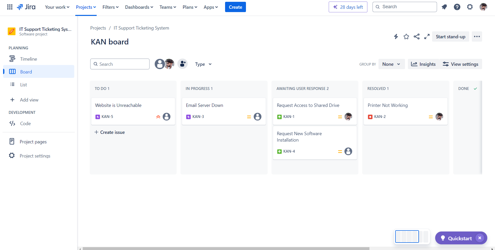
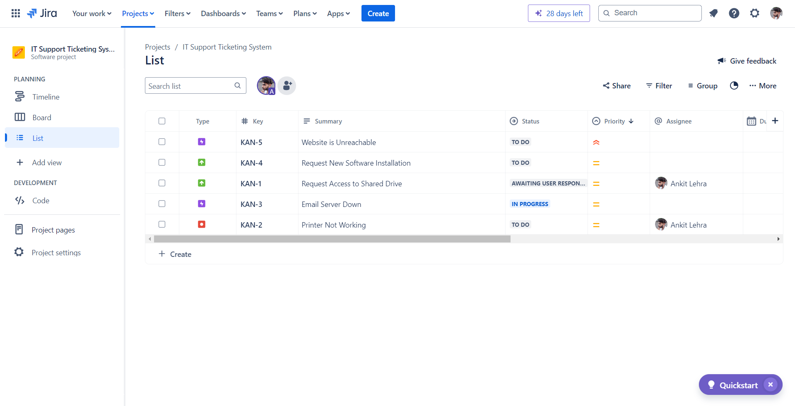
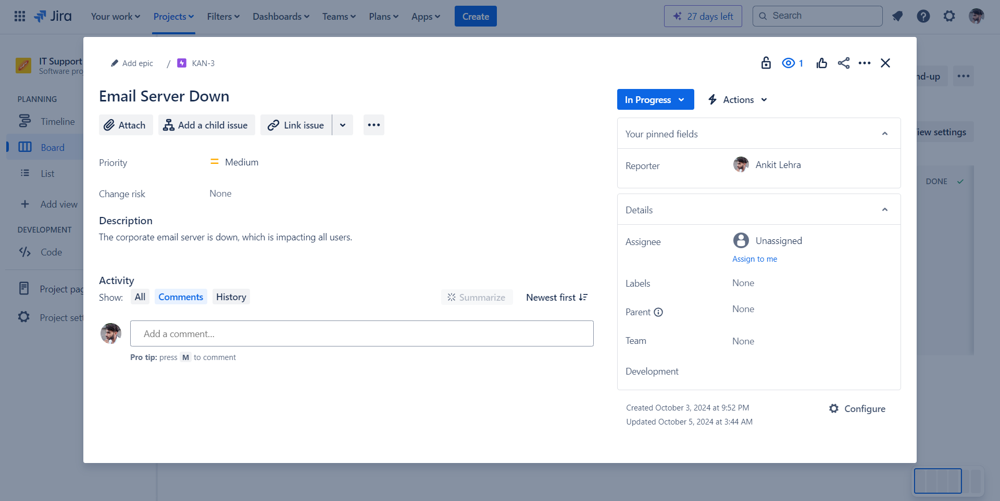
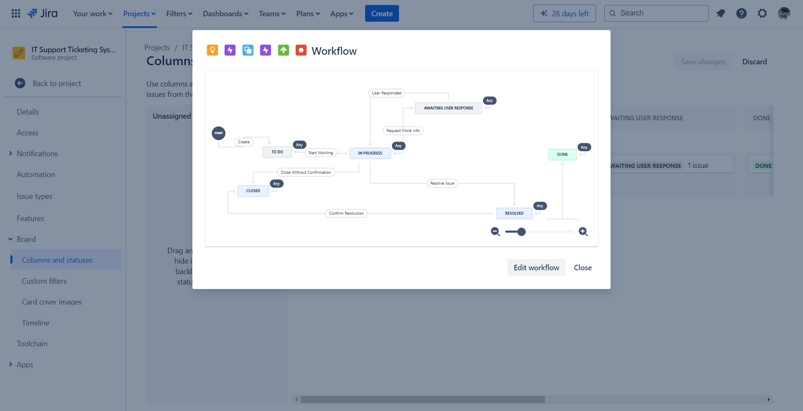

# IT Support Ticketing System

## Project Overview
The **IT Support Ticketing System** is a Jira-based solution for managing and resolving technical issues. It is designed to simulate a real-world IT support environment using Jira's powerful project management features.

## Key Features
- Centralized ticket management using a Kanban board.
- Custom workflows for issue tracking.
- Priority assignment for effective resolution.
- Visibility into ticket status through a list view and board view.

## Project Screenshots

### 1. Board View
This is the primary view of the ticket management system, showcasing the status of various tickets.


### 2. List View
An overview of all tickets in a tabular format, showing type, priority, status, and summary.


### 3. Ticket Lifecycle
The details of a ticket's lifecycle, demonstrating the progression through the workflow.


### 4. Workflow View
A visual representation of the custom ticket workflow for handling various types of IT issues.


## How to Run This Project
1. **Clone the repository**:
   ```bash
   git clone https://github.com/yourusername/IT-Support-Ticketing-System.git
