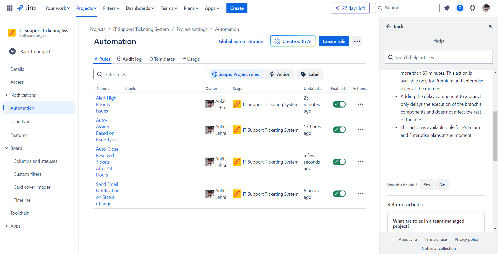

# IT Support Ticketing System

## Project Overview
The **IT Support Ticketing System** is a Jira-based solution for managing and resolving technical issues. It is designed to simulate a real-world IT support environment using Jira's powerful project management features.

## Key Features
- Centralized ticket management using a Kanban board.
- Custom workflows for issue tracking.
- Priority assignment for effective resolution.
- Visibility into ticket status through a list view and board view.

## Project Screenshots

### 1. Board View
This is the primary view of the ticket management system, showcasing the status of various tickets.

### 2. List View
An overview of all tickets in a tabular format, showing type, priority, status, and summary.

### 3. Sample Ticket
Screenshot of a sample Jira ticket titled "Email Server Down," demonstrating issue tracking and status management.

### 4. Workflow View
A visual representation of the custom ticket workflow for handling various types of IT issues.

### 5. Automation Rules Overview
This view shows the automation rules configured in the system to handle ticket management automatically.

## Automation Rules Implemented

### 1. Alert High Priority Issues
- **Description**: Sends an alert when a new high-priority issue is created.

### 2. Auto-Assign Based on Issue Type
- **Description**: Automatically assigns tickets based on the type of issue (e.g., Bug, Task, Incident).

### 3. Auto-Close Resolved Tickets After 48 Hours
- **Description**: Closes tickets automatically if they remain in the "Resolved" status for 48 hours.

### 4. Send Email Notification on Status Change
- **Description**: Sends an email notification when the status of a ticket changes.
